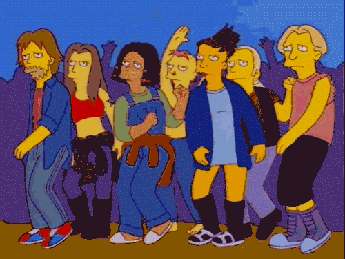

# Multi Fuzz For All

A fun fuzz with different settings and tweakable parameters.

## How Work?
The two basic models of fuzz here are a Big Muff and a sort of 60s fuzz (like a fuzz face or tonebender).

- **SCOOP** sets the amount of mid scoop at 1kHz for that lovely Big Muff sound we all know and love.  Fully right is fully flat!
- **MORE** adds more fuzz.  In Big Muff mode the hard-clipping threshold is lowered and in Fuzz Face mode the signal is inverted, scaled and put back through the wringer once more (see below for more deets).
- **OCT** half-wave rectification lads.  Clips the negative side of the wave to 0 to make that weird octave-y sound
- **STYLE** sets the mode
- **TREBLE AND BASS** are two active filters for boost and cut

## Nerdery
The Big Muff code is pretty simple.  A basic soft-clip algorithm, filter, boost, hard clip!  This is basically what the original circuit does and it sounds ok.  The "more" switch
lowers the clipping threshold during the hard-clip phase.

The 60s mode was a bit of a ballache to be honest.  I just couldn't get some of the distortion algorithms to work ([like this one])(https://www.youtube.com/watch?v=rnvEA7SOaSA&t=846s)
so I gave up and worked out a transfer function (using [this](https://www.ampbooks.com/mobile/dsp/preamp/) method) which sounded the best.  The "more" switch inverts the signal
scales it by 80% and sends it round to be distorted again.  This scaling keeps some of the asymmetrical character.

The "octave" button does the classic half-wave rectification thing by clipping the positive signal to zero.  Again, very simple.

Tone wise I thought having two boost.cut shelving filters for treble and bass would round off the sound nicely.  The scoop circuit is there to give you the Big Muff sound basically but I really like the un-scooped BMP thing as well. 

## Why does it look like that?
I figured there were two kinds of fuzz - one for hippy boomers and one for miserable gen-X-ers (I am a confused Millennial).  I designed the vibes in this regard and named 
the modes after these two contrasting simpsons episodes.

